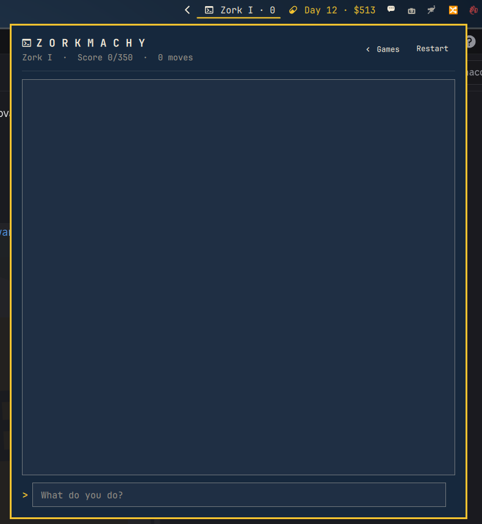
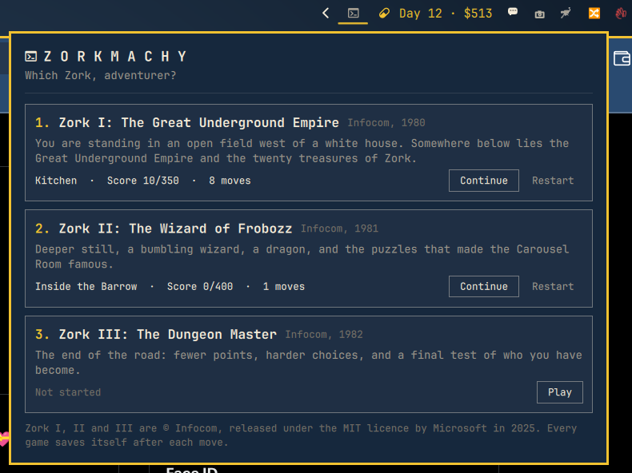

# Zorkmachy

Zork I, II and III in the Omarchy bar. The three original Infocom games are
included, they run on the real Z-machine interpreter (frotz), and every move
is saved, so you can close the panel, reboot, and pick the adventure back up
whenever you feel like it.

<p align="center">
  
</p>

## What's in it

- **All three games, in the box.** `games/` holds `zork1.z3`, `zork2.z3` and
  `zork3.z3` exactly as published by Microsoft in the historicalsource
  repositories under the MIT licence (November 2025), with that licence and
  the source commits recorded next to them. Nothing to download.
- **The genuine games.** Nothing is re-implemented. The story files run on
  dfrotz, the plain-text build of frotz, the standard Z-machine interpreter.
- **A save after every move.** Zorkmachy quietly issues the game's own `save`
  after each command and `restore` when you come back. Each game keeps its
  own save and transcript, so you can have all three going at once.
- **The classic look.** A transcript, a `>` prompt, the room, score and moves
  in the status line. Up and Down recall earlier commands.

<p align="center">
  
</p>

## Install

From the marketplace:

```bash
omarchy plugin add https://github.com/ninepointlabs/omarchy-zorkmachy --enable
```

Or from a checkout:

```bash
git clone https://github.com/ninepointlabs/omarchy-zorkmachy ~/Projects/omarchy-zorkmachy
cd ~/Projects/omarchy-zorkmachy
./install.sh            # copies into ~/.config/omarchy/plugins/ninepointlabs.zorkmachy and enables it
```

The only dependency is the interpreter, the Arch package `frotz-dumb`. If it
isn't installed, the panel says so and offers a button that opens a terminal
running `omarchy pkg add frotz-dumb`; nothing is installed behind your back.
You can also run that command yourself.

`install.sh right` puts the chip in the right section of the bar (the
default); use `left` or `center` if you prefer.

## Remove

```bash
omarchy plugin remove ninepointlabs.zorkmachy
rm -rf ~/.local/state/omarchy-zorkmachy      # optional: saves and transcripts
sudo pacman -Rns frotz-dumb                  # optional: the interpreter
```

## Playing

Click the console glyph in the bar.

- The first screen lists the three games with where you are in each. Click
  a card, its **Play** or **Continue** button, or press 1, 2 or 3.
- In a game, type what you'd type in Zork and press Enter. Up and Down walk
  through your earlier commands. Escape closes the panel; your game is
  already saved.
- **Games** goes back to the list; the game you leave stays exactly where it
  was. **Restart** starts the current game from the beginning after a
  confirmation.
- `save`, `restore`, `quit` and `restart` typed into the game are caught and
  explained rather than sent on, because Zorkmachy handles all of that for
  you. Everything else, including `score`, `inventory`, `diagnose`, `verbose`
  and the whole Zork vocabulary, goes straight to the game.

The bar chip shows which Zork is open and your score.

## Settings

In `~/.config/omarchy/shell.json`, on the widget's entry:

| key          | default | meaning                                              |
|--------------|---------|------------------------------------------------------|
| `showStatus` | `true`  | Show "Zork I · score" next to the glyph in the bar   |

## Security notes

- The plugin runs one child process, `/usr/bin/dfrotz`, always as an argument
  list (no shell), and talks to it over its stdin and stdout. Nothing you
  type is ever passed to a shell; it goes to the game's parser as one line of
  printable text, capped at 200 characters.
- dfrotz is started with `-R <state dir>`, which restricts every file it can
  read or write to `~/.local/state/omarchy-zorkmachy/`. A `save` to
  `/etc/passwd` lands there as `passwd.qzl`.
- The plugin makes no network connections. The install button only opens a
  terminal running Omarchy's own package command, and only when you click it.
- The state file is the one thing read from disk, and every field is
  type-checked, range-checked and length-capped on load. All panel text is
  rendered as plain text.
- Nothing outside the state directory is written; the bar entry in
  `shell.json` is managed by Omarchy's plugin commands.

## Where things live

- `games/`: the three story files, Microsoft's MIT `LICENSE`, and
  `SOURCES.txt` with the exact upstream commits they were copied from.
- `~/.local/state/omarchy-zorkmachy/state.json`: transcripts and status;
  `zork1.qzl` etc.: the Quetzal save files the games themselves write.
- `Games.js`: game metadata and the parsing of dfrotz's output.
  `Service.qml` drives the interpreter and owns the saves. `Panel.qml` is the
  screen, `BarWidget.qml` the chip.
- `node test/parse.js` checks the parser against captured dfrotz output.

## IPC

```bash
omarchy-shell shell summon ninepointlabs.zorkmachy '{}'     # open
omarchy-shell shell hide ninepointlabs.zorkmachy             # close
qs -p /usr/share/omarchy/shell ipc call ninepointlabs.zorkmachy status
qs -p /usr/share/omarchy/shell ipc call ninepointlabs.zorkmachy send "open mailbox"
```

## Licence

The plugin is MIT (Ninepoint Labs). Zork I, II and III are © Infocom, Inc.,
licensed under the MIT licence by Microsoft; see `games/LICENSE`. "Zork" is
a trademark of its owner; this is a fan-made player, not an official
release.
